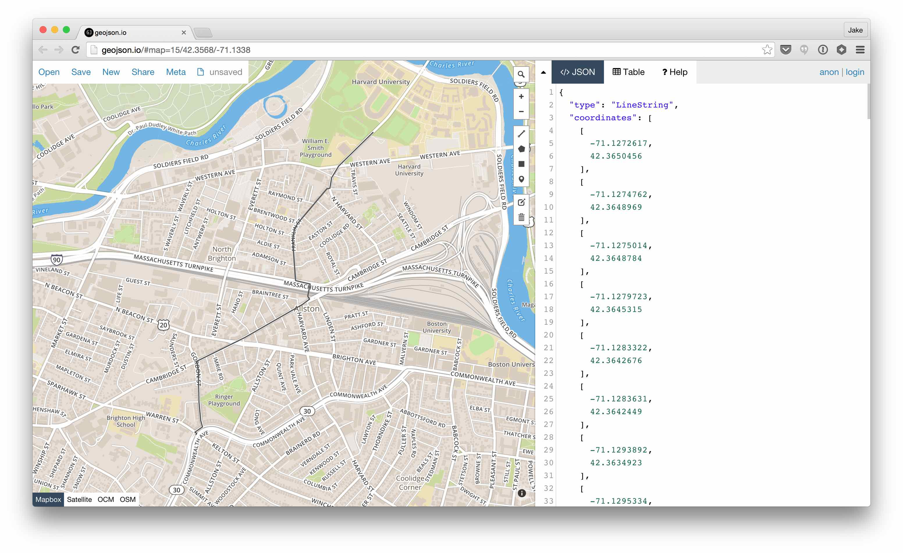

osmgraph
========

Create [networkx](https://networkx.github.io/) graphs from OpenStreetMap (OSM)
data.  `osmgraph` uses
[imposm-parser](https://github.com/omniscale/imposm-parser) for parsing
OpenStreetMap XML (including bz2) and PBF
files and [osmqa-parser](https://github.com/mapkin/osmqa-parser) for parsing
[OSM QA tiles](http://osmlab.github.io/osm-qa-tiles/).


Usage
-----

```
>>> import osmgraph
>>> g = osmgraph.parse_file(filename)
```

Install [osmqa-parser](https://github.com/mapkin/osmqa-parser) to import a graph from a vector tile. Read the [documentation](https://github.com/mapkin/osmqa-parser#data-model-caveats) to understand the caveats associated with forming a network from OSM QA tiles.

```
### Load data from mbtiles or other source
>>> g = osmgraph.parse_qa_tile(x, y, zoom, data)
```


Graph Structure
---------------
`osmgraph` parses OSM data to create a networkx [directed graph](https://networkx.readthedocs.org/en/stable/reference/classes.digraph.html). OSM nodes correspond directly to the nodes in the directed graph. The OSM tags become attributes of the node. Additionally `osmgraph` adds a `coordinate` attribute containing the (lon, lat) tuple of the node's coordinates.

For example:
```
g = osmgraph.parse_file('boston_massachusetts.osm.bz2')
```

Given the following XML node:
```
  <node id="665539692" lat="42.3971185" lon="-71.0207486" version="2" timestamp="2014-06-25T04:45:25Z" changeset="23135192" uid="422979" user="Parcanman">
    <tag k="railway" v="level_crossing"/>
  </node>
```

```
>>> g.node[665539692]
{'coordinate': (-71.0207486, 42.3971185), 'railway': 'level_crossing'}
```

Similarly, the nodes comprising an OSM way form the graph's edges. The way's attributes are duplicated across the edges. For example, given the following XML way:
```
  <way id="8636532" version="13" timestamp="2011-01-14T00:47:46Z" changeset="6963395" uid="381909" user="JessAk71">
    <nd ref="61448456"/>
    <nd ref="1102764005"/>
    <nd ref="1099120555"/>
    <nd ref="1099120556"/>
    <nd ref="61420229"/>
    <nd ref="61420222"/>
    <nd ref="61420249"/>
    <nd ref="61420207"/>
    <nd ref="61420214"/>
    <nd ref="643774918"/>
    <tag k="name" v="North Washington Street"/>
    <tag k="width" v="30.2"/>
    <tag k="oneway" v="yes"/>
    <tag k="source" v="massgis_import_v0.1_20071008193615"/>
    <tag k="highway" v="primary"/>
    <tag k="condition" v="fair"/>
    <tag k="attribution" v="Office of Geographic and Environmental Information (MassGIS)"/>
    <tag k="massgis:way_id" v="134349"/>
  </way>
```

```
>>> g[61448456][1102764005]
{'attribution': 'Office of Geographic and Environmental Information (MassGIS)',
 'condition': 'fair',
 'highway': 'primary',
 'massgis:way_id': '134349',
 'name': 'North Washington Street',
 'oneway': 'yes',
 'source': 'massgis_import_v0.1_20071008193615',
 'width': '30.2'}
```

Ways that are not oneway roads will have edges in both directions.


Notes
-----
`osmgraph` loads the entire graph in memory. You should be careful how much
data is being loaded. All parsing functions accept a `ways_tag_filter` and
`nodes_tag_filter` arguments. These are functions that accept a dictionary
of node or way tags. They should manipulate the dictionary in place to drop
unused tags.

For example, if we only care about nodes containing a traffic light.

```
def traffic_lights_filter(tags):
    if tags.get('highway') != 'traffic_signals':
        tags.clear()

g = osmgraph.parse_file(filename, nodes_tag_filter=traffic_lights_filter)
```

Example: Build a Cheapo Router
-----------------------------------
Parse some OSM data, add a `length` property to each edge using
[geog](https://github.com/jwass/geog), use networkx's builtin shortest path
algorithm to find the shortest path between two nodes, use [geojsonio.py](https://github.com/jwass/geojsonio.py) to show the line on [geojson.io](https://geojson.io)

```
import geog
import networkx as nx
import osmgraph

# By default any way with a highway tag will be loaded
g = osmgraph.parse_file('boston_massachusetts.osm.bz2')  # or .osm or .pbf
for n1, n2 in g.edges_iter():
    c1, c2 = osmgraph.tools.coordinates(g, (n1, n2))   
    g[n1][n2]['length'] = geog.distance(c1, c2)


import random
start = random.choice(g.nodes())
end = random.choice(g.nodes())
path = nx.shortest_path(g, start, end, 'length')
coords = osmgraph.tools.coordinates(g, path)

# Find the sequence of roads to get from start to end
edge_names = [g[n1][n2].get('name') for n1, n2 in osmgraph.tools.pairwise(path)]
import itertools
names = [k for k, v in itertools.groupby(edge_names)]
print(names)
     ['North Harvard Street',
      'Franklin Street',
      'Lincoln Street',
      None,
      'Cambridge Street',
      'Gordon Street',
      'Warren Street',
      'Commonwealth Avenue']

# Visualize the path using geojsonio.py
import geojsonio
import json
geojsonio.display(json.dumps({'type': 'LineString', 'coordinates': coords}))

```



See Also
--------
* [networkx](https://networkx.github.io)
* [OSM QA Tiles](https://osmlab.github.io/osm-qa-tiles/)
* [osmqa-parser](https://github.com/mapkin/osmqa-parser/)
* [imposm.parser](https://github.com/omniscale/imposm-paser)
* [tile-reduce](https://github.com/mapbox/tile-reduce)
* [tile-reduce-py](https://github.com/jwass/tile-reduce-py)
